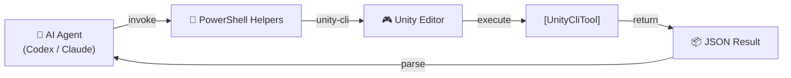

<div align="center">

# 🎮 Unity CLI Toolkit

### for AI-Assisted Unity Workflows

**Repeatable Unity automation for Codex, Claude, and AI-assisted workflows**

[](LICENSE)
[](#)
[](#)
[](#)
[](#)

[**Quick Start**](#-quick-start) · [**Setup Guide**](docs/getting-started.md) · [**Examples**](#-examples) · [**Contributing**](#-contributing)

</div>

---

## ✨ Features

- **🔄 Proven Setup Flow** — A tested Windows/Codex setup flow for `unity-cli`
- **⚡ PowerShell Helpers** — Reusable helpers for safe `unity-cli` invocation and Unity batch methods
- **🧩 Custom Tool Templates** — Starter templates for writing custom `[UnityCliTool]` commands
- **✅ Validation Workflow** — Repeatable validation for compile, console, scene, prefab, resource, and test checks
- **📋 Copyable Examples** — PowerShell examples that work with Unity + `unity-cli` out of the box
- **🎯 Multi-Instance Support** — Guidance for choosing the correct Unity Editor with `--project`
- **🛡️ Safer Patterns** — Validation patterns for domain reloads, compile waits, and wrapper tools

---

## 🚀 Quick Start

> [!NOTE]
> **Prerequisite**: `unity-cli` must be installed and available on your PATH. A Unity project must be open in the Editor.

```powershell
$PSNativeCommandArgumentPassing = "Standard"
unity-cli --project C:/Path/To/YourProject status
unity-cli --project C:/Path/To/YourProject list
unity-cli --project C:/Path/To/YourProject compile_check_tool
```

---

## ⚙️ How It Works



<details>
<summary>Can't see the diagram? View the text version.</summary>

```
AI Agent (Codex/Claude) → PowerShell Helpers → Unity Editor → [UnityCliTool] → JSON Result → Agent
```

</details>

---

## 📁 Repo Map

```
Unity_Cli_Jason/
├── 📄 README.md              # You are here
├── 📂 docs/                   # Setup, troubleshooting, workflow docs
│   ├── getting-started.md
│   ├── codex-setup.md
│   ├── custom-tools.md
│   ├── validation-workflow.md
│   └── troubleshooting.md
├── 📂 templates/              # Starter files for custom tools & scripts
│   ├── cli-tool-template/
│   ├── validation-script/
│   └── repo-bootstrap/
├── 📂 scripts/                # Setup and verification helpers
│   ├── invoke-unity-cli-safe.ps1
│   ├── wait-unity-ready.ps1
│   └── invoke-unity-batch-method.ps1
└── 📂 examples/               # Concrete examples & case studies
    ├── compile-check/
    ├── scene-validation/
    ├── robot-kinematics/
    └── case-study-kine-tutor3d/
```

---

## 📖 Examples

<details>
<summary><strong>🔧 Custom Tool Invocation</strong></summary>

```powershell
$PSNativeCommandArgumentPassing = "Standard"
unity-cli --project C:/Path/To/YourProject fk_compute_tool --params '{"template":"ExampleBot","joints":"0,45"}'
```

</details>

<details>
<summary><strong>✅ Full Validation Flow</strong></summary>

```powershell
$PSNativeCommandArgumentPassing = "Standard"
./scripts/wait-unity-ready.ps1 -ProjectPath C:/Path/To/YourProject
./scripts/invoke-unity-cli-safe.ps1 -ProjectPath C:/Path/To/YourProject compile_check_tool
./scripts/invoke-unity-cli-safe.ps1 -ProjectPath C:/Path/To/YourProject console_check_tool --params '{"type":"error"}'
./scripts/invoke-unity-cli-safe.ps1 -ProjectPath C:/Path/To/YourProject scene_validate_tool --params '{"name":"all"}'
./scripts/invoke-unity-cli-safe.ps1 -ProjectPath C:/Path/To/YourProject resource_validate_tool
```

</details>

<details>
<summary><strong>📜 Script Helpers Reference</strong></summary>

| Script | Description |
|--------|-------------|
| `invoke-unity-cli-safe.ps1` | Wraps `unity-cli` calls with stable PowerShell defaults, retry support, and project-aware status handling |
| `wait-unity-ready.ps1` | Waits for the correct Unity project to reach `ready`, but fails fast on `no instance` and `project locked` |
| `invoke-unity-batch-method.ps1` | Runs any Unity `-executeMethod` in batchmode, checks for project-lock conflicts, and can retry once after compile-only passes when you provide a success pattern |

</details>

---

## 👥 Who This Is For

| Audience | Use Case |
|----------|----------|
| **Unity Developers** | Using AI agents (Codex, Claude, etc.) in your daily workflow |
| **Teams** | Building project-specific `unity-cli` custom tools |
| **Anyone** | Looking for a repeatable way to inspect, validate, and automate Unity Editor state |

---

> [!NOTE]
> ## 📐 Design Rules
>
> - Tool logs and response messages should be written in **English**.
> - Tool names and parameter shapes should be **project-agnostic** and reusable across Unity projects.
> - Prefer generic inputs such as `scene`, `required_objects`, and `forbidden_objects` over project-specific names.
> - Keep project-specific behavior behind scene paths, method names, or arrays passed through `--params`.

---

<details>
<summary><strong>🪟 Codex / Windows Notes</strong></summary>

- Use registered tool names such as `compile_check_tool`, not guessed kebab-case aliases.
- In PowerShell, prefer `--params '{"key":"value"}'` when passing strings, booleans, or comma-separated values.
- Set `$PSNativeCommandArgumentPassing = "Standard"` before invoking complex commands.
- If more than one Unity project is open, prefer `unity-cli --project C:/Path/To/YourProject ...`.
- After menu execution, recompiles, or build-target switches, wait for `status` to return `ready` before chaining the next command.
- Prefer `scripts/invoke-unity-cli-safe.ps1` inside PowerShell automation when you want retries and clearer failure messages.
- Prefer `scripts/invoke-unity-batch-method.ps1` for batch `-executeMethod` runs instead of hand-writing raw Unity command lines every time.

</details>

---

> [!IMPORTANT]
> ## ⚠️ Known Reality
>
> - **EditMode** automation is usually the most reliable baseline.
> - **PlayMode** automation can be environment-sensitive and may require batch or isolated project workflows.
> - Custom wrapper tools such as `run_edit_mode_tests_tool` are often more reliable than JSON-heavy test commands in PowerShell scripts.

---

## 🗺️ Roadmap

- [ ] More reusable custom tool templates
- [ ] Better PlayMode runner guidance
- [ ] More agent-specific setup notes
- [ ] Cross-platform examples beyond Windows

---

## 🤝 Contributing

[](https://github.com/kimjuyoung1127/Unity_Cli_Jason/issues)

Issues and PRs are welcome, especially for:

- New generic custom tool templates
- Better `unity-cli` validation flows
- Cross-project examples
- Windows/macOS/Linux environment notes

---

<div align="center">

**Built for AI-assisted Unity workflows**

[⬆ Back to top](#-unity-cli-toolkit)

</div>
